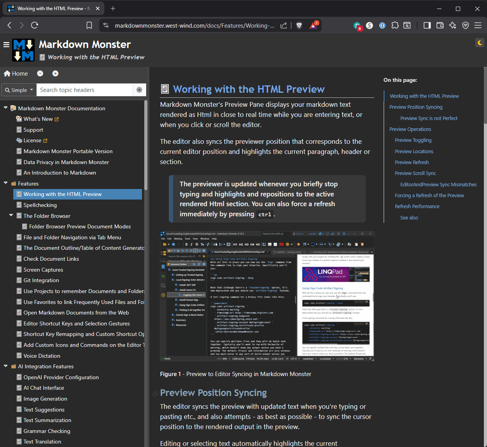
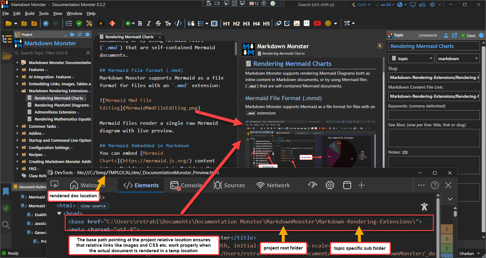
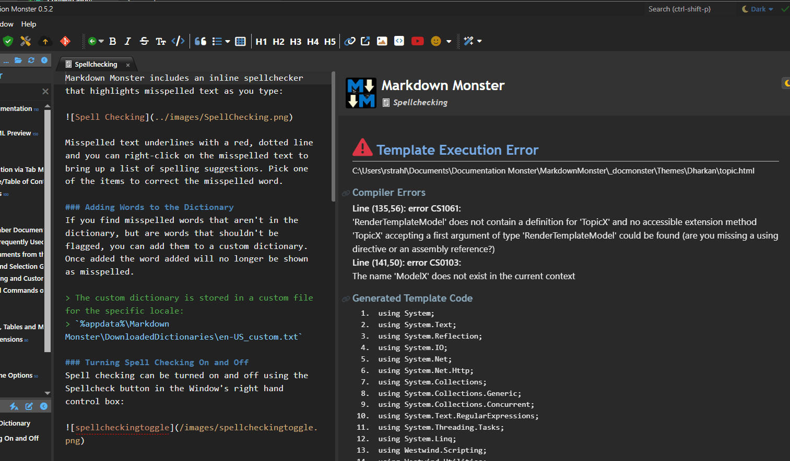

# Putting the Westwind.Scripting Templating Library to work, Part 2


> This is a two part series that discusses the Westwind.Scripting Template library
> 
> * [Part 1: An introduction and how it works]()
>   
> * **Part 2**: Real world integration for a Local Rendering and Web Site Generation
>   <small> *(this post)*</small>


This is part 2 of 2 part series about the WestWind.Scripting and the C# Template Scripting features of the library. In part 1, I introduced the Westwind.Scripting library, how it works and how you can use it and integrate it into your applications. In this part 2, I'm going over implementation details of hosting a scripting engine that generates local static Html output for a for a project based solution that requires both local preview and local Web site generation. As part of that process I'll point out some of the issues that you likely have to consider in this somewhat common scenario.

Before you read on, I'd recommend you read, so you have a good feel what the library provides. Without this context this post won't make a ton of sense.

* [Revisiting Westwind.Script Template Scripting Library, Part 1]()


## Putting Templating to use in a Real World Scenario
In part 1 I gave you a good idea of how you can use the `ScriptParser` class to render C# scripting templates that mix literal text and C# code using a handle bars style syntax. Now let's take a look at a real world application integration scenario.

While using the `ScriptParser` for demos and single template situations is simple enough, using it to integrate into a larger application and interact with host application features requires a bit more work. 

I'm using my [Documentation Monster](https://documentationmonster.com) application, which is a project based documentation solution that produces Html output as an example here. I mentioned DM in part 1 a few times, so recall that DM is a documentation solution that uses templates to render topics in two ways:

* Render a single topic for Live Preview as you type topic content
* Render many topics in a Doc Project into a full self-contained Web site

In DM, I use script templates to render each topic, with a specific topic type - Topic, Header, ClassHeader, ClassMethod, ClassProperty, WhatsNew, ExternalLink etc. -  each representing a separate Html template in an Html file (ie. `Topic.html`) on disk. These topic templates templates have overlapping content: In fact all of them have a header and topic body, but many of the topic types have customized areas to them: For example, *ClassHeader* has a class member table, inheritance list, lists assembly and namespace, ClassProperty/Method/Field/Event member templates have syntax and exception settings, External links display an Html page during development but redirect to a Url in a published output file etc. In other words, each topic type has some unique things going on with it. If not - the template can be missing and the default topic template (type *Topic*) is used via fallback.

Rendering sounds simple enough, and it is. But but once you introduce document dependencies  like images, scripts, css etc. and you create output that may end up in nested folders, pathing can become problematic. For example, what's a relative path based on? What's a root path (`/`) based on? The rendered output has to be self-contained, and templates are responsible for properly making paths natural to use. That doesn't happen automatically - some Urls may have to be fixed up and in some cases a `<base>` has to be provided in the Html content for each page.

In addition when rendering topics a few things that need to be considered:

* When and how to render using the ScriptParser
* Where to store the Templates consistently
* Ensure that rendered output can be referenced relatively
* Ensure there's consistent BasePath to reference 
  root and project wide Urls

Let's walk through what this looks like inside of an application.

### Create a TemplateHost
In projects that use template rendering I like to create a **TemplateHost** class that encapsulates the rendering tasks. This simplifies configuration of the template engine in one place and provides a few easily accessible methods for easily rendering templates - in the case of DM rendering topics to string and to file.

#### Configuration
Let's start with the configuration for the ScriptParser:

```csharp
public class TemplateHost
{
    public ScriptParser Script
    {
        get
        {
            if (field == null)
                field = CreateScriptParser();
            return field;
        }
        set;
    }

    public static ScriptParser CreateScriptParser()
    {
        var script = new ScriptParser();            
        
        script.ScriptEngine.AddDefaultReferencesAndNamespaces();
        script.ScriptEngine.AddLoadedReferences();

        script.ScriptEngine.AddNamespace("Westwind.Utilities");
        script.ScriptEngine.AddNamespace("DocMonster");
        script.ScriptEngine.AddNamespace("DocMonster.Model");            
        script.ScriptEngine.AddNamespace("DocMonster.Templates");
        script.ScriptEngine.AddNamespace("MarkdownMonster");
        script.ScriptEngine.AddNamespace("MarkdownMonster.Utilities");

        script.ScriptEngine.SaveGeneratedCode = true;
        script.ScriptEngine.CompileWithDebug = true;            

        // {{ expr }} is Html encoded - {{! expr }} required for raw Html output
        script.ScriptingDelimiters.HtmlEncodeExpressionsByDefault = true;            

		// custom props that expose in the template without Model. prefix
        script.AdditionalMethodHeaderCode =
            """
            DocTopic Topic = Model.Topic;
            var Project = Model.Project;
            var Configuration = Model.Configuration;
            var Helpers = Model.Helpers;                
            var DocMonsterModel = Model.DocMonsterModel;
            var AppModel = MarkdownMonster.mmApp.Model;
            
            var BasePath = new Uri(FileUtils.NormalizePath( Project.ProjectDirectory + "\\") );

            """;            
        return script;
    }
    
    // render methods below
}
```

In DM the TemplateHost is created on first access of a `Project.TemplateHost` property and then persists for the lifetime of the project unless explicitly recreated as there is some overhead in creating the script parser environment and we might be generating **a lot** of documents very quickly.

Notice that the parser is set up with common default and all loaded assembly references from the host. I then add all the specific libraries that may not have been loaded yet, and any custom namespaces that are used by the various application specific components that are used in the templates. This is perhaps the main reason to use a `TemplateHost` like wrapper: To hide away all this application specific configuration for a one time config and then can be forgotten about - you don't want to be doing this sort of thing in your application or business logic code.

Another thing of note: The `AdditionalMethodHeaderCode` property is used to expose various objects as top level objects to the template script. So rather than having to specify `{{ Model.Topic.Title }}` we can just use `{{ Topic.Title }}` and `{{ Helpers.ChildTopicsList() }}` for example. Shortcuts are useful, and you can stuff anything you want to expose in the script beyond the model here. 

> Since the templates in DM are accessible to end-users for editing, making the template expressions simpler makes for a more user friendly experience. Highly recommended.

#### Rendering
The actual render code is pretty straight forward by calling `RenderTemplateFile()` which renders a template from file:

```cs
public string RenderTemplateFile(string templateFile, RenderTemplateModel model)
{
    ErrorMessage = null;

    Script.ScriptEngine.ObjectInstance = null; // make sure we don't cache

    string basePath = model.Project.ProjectDirectory;
    model.PageBasePath = System.IO.Path.GetDirectoryName(model.Topic.RenderTopicFilename);

    string result = Script.ExecuteScriptFile(templateFile, model, basePath: basePath);

    if (Script.Error)
    {
        result = ErrorHtml();
        ErrorMessage = Script.ErrorMessage + "\n\n" + Script.GeneratedClassCodeWithLineNumbers;
    }

    return result;
}
```

This is the basic raw template execution logic that produces direct generated output - in this case Html.

#### Template Layout
I haven't talked about what the templates look like: DM uses relatively small topic templates, with a fairly complex Layout page that provides for the page chrome. The actual project output renders a both the content the headers and footers and there's a bunch of logic to pull in the table of contents and handle navigation to new topics efficiently. All of that logic is encapsulated in the layout page and some of the support JavaScript scripts.

At the core however are the topic templates. Each topic type is a template. Topic, Header, WhatsNew, ClassHeader, ClassProperty, ClassMethod etc. each with their own custom formats. Each of the templates then references a layout page.

**topic.html Template**

```html
{{%
    Script.Layout = "_layout.html";
}}

<h2 class="content-title">
    
    {{ Model.Topic.Title }}
</h2>

<div class="content-body" id="body">
    {{% if (Topic.IsLink && Topic.Body.Trim().StartsWith("http")) { }}
        <ul>
        <li>
            <a href="{{! Model.Topic.Body }}" target="_blank">{{ Model.Topic.Title }}</a>
            <a href="{{! Model.Topic.Body }}" target="_blank"><i class="fa-solid fa-up-right-from-square" style="font-size: 0.7em; vertical-align: super;"></i></a>
        </li>
        </ul>

        <blockquote style="font-size: 0.8em;"><i>In rendered output this link opens in a new browser window.
            For preview purposes, the link is displayed in this generic page.
            You can click the link to open the browser with the link which is the behavior you see when rendered.</i>
        </blockquote>
    {{% } else { }}
        {{ Model.Helpers.Markdown(Model.Topic.Body) }}
    {{% } }}
    
</div>

{{% if (!string.IsNullOrEmpty(Model.Topic.Remarks)) {  }}
    <h3 class="outdent" id="remarks">Remarks</h3>
    {{ Helpers.Markdown(ModelTopic.Remarks) }}
{{% } }}


{{% if (!string.IsNullOrEmpty(Topic.Example))  {  }}
    <h3 class="outdent" id="example">Example</h3>
    {{ Helpers.Markdown(Topic.Example) }}
{{% } }}

{{% if (!string.IsNullOrEmpty(Topic.SeeAlso)) { }}
    <h4 class="outdent" id="seealso">See also</h4>
    <div class="see-also-container">
        {{ Helpers.FixupSeeAlsoLinks(Topic.SeeAlso) }}
    </div>
{{% } }}
```

For demonstration purposes I'm showing both the original `Model.Topic` and the custom header based direct binding to `Topic` via `script.AdditionalMethodHeaderCode` I showed earlier which both point at the same value.

Note also the code block at the top that pulls in the `_layout.html` page:

```html
{{%
    Script.Layout = "_layout.html";
}}
```

which pulls the content page into the layout page's content. The layout page then looks like this (slightly truncated)

**_Layout.html**

```html
<!DOCTYPE html>
<html>
<head>
    {{%
     var theme = Project.Settings.RenderTheme;
     if(Topic.TopicState.IsPreview) { }}
    <base href="{{ Model.PageBasePath }}" />
    {{% } }}

    <meta charset="utf-8" />
    <title>{{ Topic.Title }} - {{ Project.Title }}</title>

    {{% if (!string.IsNullOrEmpty(Topic.Keywords)) { }}
    <meta name="keywords" content="{{ Topic.Keywords.Replace(" \n",", ") }}" />
    {{% } }}
    {{% if(!string.IsNullOrEmpty(Topic.Abstract)) { }}
    <meta name="description" content="{{! Topic.Abstract }}" />
    {{% } }}
    <meta name="viewport" content="width=device-width, initial-scale=1,maximum-scale=1" />
    <link rel="stylesheet" type="text/css" href="~/_docmonster/themes/scripts/bootstrap/bootstrap.min.css" />
    <link rel="stylesheet" type="text/css" href="~/_docmonster/themes/scripts/fontawesome/css/font-awesome.min.css" />
    <link id="AppCss" rel="stylesheet" type="text/css" href="~/_docmonster/themes/{{ theme }}/docmonster.css" />

    <script src="~/_docmonster/themes/scripts/highlightjs/highlight.pack.js"></script>
    <script src="~/_docmonster/themes/scripts/highlightjs-badge.min.js"></script>
    <link href="~/_docmonster/themes/scripts/highlightjs/styles/vs2015.css" rel="stylesheet" />
    <script src="~/_docmonster/themes/scripts/bootstrap/bootstrap.bundle.min.js" async></script>
    <script src="~/_docmonster/themes/scripts/lunr/lunr.min.js"></script>
    <script>
        window.page = {};
        window.page.basePath = "{{ Project.Settings.RelativeBaseUrl }}";
        window.renderTheme="{{ Project.Settings.RenderThemeMode }}";
    </script>
    <script src="~/_docmonster/themes/scripts/docmonster.js"></script>

    {{% if(Topic.TopicState.IsPreview) { }}
    <!-- Preview Navigation and Syncing -->
    <script src="~/_docmonster/themes/scripts/preview.js"></script>
    {{% } }}

</head>
<body>
    <!-- Markdown Monster Content -->
    <div class="flex-master">
        <div class="banner">
            <div class="float-end">
                <button id="themeToggleBtn" type="button" onclick="toggleTheme()"
                        class="btn btn-sm btn-secondary theme-toggle"
                        title="Toggle Light/Dark Theme">
                    <i id="themeToggleIcon"
                       class="fa fa-moon text-warning">
                    </i>
                </button>
            </div>

            <div class="float-start sidebar-toggle">
                <i class="fa fa-bars"
                   title="Show or hide the topics list"></i>
            </div>

			{{% if (Topic.Incomplete) { }}
               <div class="float-end mt-2 " title="This topic is under construction.">
                   <i class="fa-duotone fa-triangle-person-digging fa-lg fa-beat"
                   style="--fa-primary-color: #333; --fa-secondary-color: goldenrod; --fa-secondary-opacity: 1; --fa-animation-duration: 3s;"></i>
	           </div>
		    {{% } }}

            
            <div class="projectname"> {{ Project.Title }}</div>

            <div class="byline">
                
                {{ Topic.Title }}
            </div>
        </div>
        <div class="page-content">
            <div id="toc-container" class="sidebar-left toc-content">
                <nav class="visually-hidden">
                    <a href="~/tableofcontents.html">Table of Contents</a>
                </nav>
            </div>

            <div class="splitter">
            </div>

            <nav class="topic-outline">
                <div class="topic-outline-header">On this page:</div>
                <div class="topic-outline-content"></div>
            </nav>

            <div id="MainContent" class="main-content">
                <!-- Rendered Content -->

                <article class="content-pane">
                    {{ Script.RenderContent() }}
                </article>

                <div class="footer">

                    <div class="float-start">
                        &copy; {{ Project.Owner }}, {{ DateTime.Now.Year }} &bull;
                        updated: {{ Topic.Updated.ToString("MMM dd, yyyy") }}
                        <br />
                        {{%
                            string mailBody = $"Project: {Project.Title}\nTopic: {Topic.Title}\n\nUrl:\n{ Project.Settings.WebSiteBaseUrl?.TrimEnd('/') + Project.Settings.RelativeBaseUrl }{ Topic.Id }.html";
                            mailBody = WebUtility.UrlEncode(mailBody).Replace("+", "%20");
                        }}
                        <a href="mailto:{{ Project.Settings.SupportEmail }}?subject=Support: {{ Project.Title }} - {{ Topic.Title }}&body={{ mailBody }}">Comment or report problem with topic</a>
                    </div>

                    <div class="float-end">
                        <a href="https://documentationmonster.com" target="_blank"></a>
                    </div>
                </div>
                <!-- End Rendered Content -->
            </div> <!-- End MainContent -->
        </div> <!-- End page-content -->
    </div>   <!-- End flex-master -->
    
    <!-- End Markdown Monster Content -->
</body>
</html>
```


The full rendered site then looks like this:

  
<small>**Figure 1** - Documentation Monster Rendered site output</small>

The rendered topic content is in the middle panel of the display - all the rest is both static and dynamically rendered Html that is controlled through the Layout page. Both the table of contents and the document outline on the right are rendered using dynamic loading via JavaScript, while the header and footer are static with some minor embedded expressions.

With a Layout page this is easy to set up and maintain as there's a single page that handles that logic and it's easily referenced from each of the topic templates with a single layout page reference.

So far things are pretty straight forward relying on the core features of the scripting engine: We're pointing at template and a layout page and it produces Html in various forms depending on the type of template that we are dealing with.

But there are a few other things that we need to consider specifically when you use Html output that is rendered into a temporary location that is external to the project.

### Base Path Handling - PageBaseFolder and BaseFolder
When rendering Html output that depends on other resources like images CSS and scripts that referenced either as relative or site rooted paths, it's important that the page context can find these resources based on natural relative and absolute page path resolution.

There are two concerns:

* Page Base Path for page relative links 
* Project Base Path for site root paths

#### Page Base Path for Relative Linking
Page base path refers to resolving relative paths in the document. For example from the current page referencing an image as `SomeImage.png` (same folder) or `../images/SomeFolder` (relative path). In order for these relative paths to work the page has to be either running directly from the folder or the page has to be mapped into that page context.

In the context of a Web site that's simple as you have a natural page path that always applies. However, for previewing pages are typically rendered to a temporary file, which is then displayed in a WebView for preview. 

This scenario can be handled by explicitly forcing the page's `<base>` path to reflect the current page's path:

```html
{{%
    if(Topic.TopicState.IsPreview)  { }}
       <base href="{{ Model.PageBasePath }}" />
{{%  }  }}
```

Note that I'm only applying the `<base>` tag only in Preview mode. In Preview the Html is rendered into a temp location, so I have to map back to the actual location where relative content is expected and so that links can work.

Here's what that looks like:

  
<small>**Figure 3** - Providing a Page Base path when rendering to a temp location is crucial to ensure relative resources like images can be found!</small>

Without the `<base>` path in the document, the page would look for the image in the rendered output location - in the `TMP` folder - and of course would not find the image there.

For final rendered output running in a Web Browser, this is not necessary as the page naturally runs out of the appropriate folder and no `<base>` path is applied.

> *Why not just render output into the 'correct' location where relative content can be found?*  
> For local preview that's often impractical due to permissions or simply for cluttering up folders with temporary render files. Local WebView content that has dependencies should always be rendered to a temporary location and then back-linked via `<base>` paths to ensure that relative paths can resolve.

#### Root Paths In Temporary Location
The other - and perhaps more important issue -  has to do with resolving the root path. This is especially important when rendering to a temporary file, but it can even be an issue if you create a 'site' that sits off a Web root. For example, most of my documentation 'sites' live in a `/docs` folder off the main Web site. 

For example:

* [Markdown Monster Documentation](https://markdownmonster.west-wind.com/docs/)

In this site, any links that reference `/` and intend to go back to the documentation root, are going to jump back to the main Web site root instead. 

So from a project perspective I want `/` to mean the project root, but I don't want to have to figured out while I'm working on it whether I have to use `/docs/` or `/`. In fact, I never want to reference `/docs/` in my templates or in user template, but rather expect to reference the doc root as `/`.

In DM this is very relevant when the site is generated. We can then specify a root folder `/` by default or `/docs/` explicitly as shown here entered for my specific site.

This then goes through the generated Html output and replaces any paths that start with `/` or `~/` to use that relative base path.

  
<small>**Figure 2** - When rendering to a non-root location it has to be generated at Html generation time.</small>

Here's what this looks like. This template section using `~/` paths provided in the templates or in user content:

```html
<link rel="stylesheet" type="text/css" href="~/_docmonster/themes/scripts/bootstrap/bootstrap.min.css" />
<link rel="stylesheet" type="text/css" href="~/_docmonster/themes/scripts/fontawesome/css/font-awesome.min.css" />
<link id="AppCss" rel="stylesheet" type="text/css" href="~/_docmonster/themes/{{ theme }}/docmonster.css" />
```

turns into fully qualified file Urls when rendering for the Previewer:

```html
<link rel="stylesheet" type="text/css" href="C:/Users/rstrahl/Documents/Documentation Monster/MarkdownMonster/_docmonster/themes/scripts/bootstrap/bootstrap.min.css">
<link href="file:///D:\projects\MarkdownMonsterCode\MarkdownMonster\bin\Release\net10.0-windows\PreviewThemes\scripts\fontawesome\css\font-awesome.min.css" rel="stylesheet" type="text/css">
<link href="file:///C:\Users\rstrahl\Dropbox\Markdown%20Monster\PreviewThemes\Blue%20Lagoon\Theme.css" rel="stylesheet" type="text/css">
```

And into root relative links when rendered in site mode:

```html
<link rel="stylesheet" type="text/css" href="/docs/_docmonster/themes/scripts/bootstrap/bootstrap.min.css" />
<link rel="stylesheet" type="text/css" href="/docs/_docmonster/themes/scripts/fontawesome/css/font-awesome.min.css" />
<link id="AppCss" rel="stylesheet" type="text/css" href="/docs/_docmonster/themes/Dharkan/docmonster.css" />
```


This means that the root path need to be fixed up depending on the root path environment. There are several scenarios:

* Root is root `/` rendered into root of site for final Html Site output - no replacements required.
* Root is a subfolder (ie. `/docs/`) - `/` is replaced with `/docs/` in all paths
* Root is the project folder from Temp location - `/` is replaced with a folder file location or WebView virtual host name root

This is something that is not part of the `ScriptParser` class, but rather has to be handled at the application layer post fix up and it's fairly specific to the Html based generation that takes place. In my template based applications I **always** have do one form or another of this.

Here's what this looks like in DOcumentation Monster:


```csharp
string html = Project.TemplateHost.RenderTemplateFile(templateFile, model);

...

// Fix up any locally linked .md extensions to .html
string basePath = null;
if (renderMode == TopicRenderModes.Html)
{
 	 // fix up DM specific `dm-XXX` links like topic refs, .md file links etc.
     html = FixupHtmlLinks(html, renderMode);  

     // Specified value in dialog ('/docs/` or `/`)
     basePath = Project.Settings.RelativeBaseUrl;  // 
}            
if (renderMode == TopicRenderModes.Preview || renderMode == TopicRenderModes.Chm)
{
	// special `dm-XXX` links are handled via click handlers
	
	// Project directory is our base folder
    basePath = Path.TrimEndingDirectorySeparator(Project.ProjectDirectory).Replace("\\", "/") + "/";
}

html = html
           .Replace("=\"/", "=\"" + basePath)
           .Replace("=\"~/", "=\"" + basePath)
           // UrlEncoded
           .Replace("=\"%7E/", "=\"" + basePath)
           // Escaped
          .Replace("=\"\\/", "=\"/")
          .Replace("=\"~\\/", "=\"/");
```

And now we finally have site content rendering correctly to resolve even non-standard local links for the preview and site links for the generated Web site.


### Error Handling
When a template is run there is a possibility that it can fail. Typically it fails because there's an error in the template itself, which tends to generate compilation errors, or you can also run into runtime errors - mostly null errors most likely :smile:

If an error occurs, DM checks for it and then generates an error page:

```
if (Script.Error)
{
    result = ErrorHtml();
    ErrorMessage = Script.ErrorMessage + "\n\n" + Script.GeneratedClassCodeWithLineNumbers;
}
```    

where `ErrorHtml()` is the method that creates the error.

You can keep this real simple and just render the error message and optionally the code:

```cs
public string ErrorHtml(string errorMessage = null, string code = null)
{            
    if (string.IsNullOrEmpty(errorMessage))
        errorMessage = Script.ErrorMessage;
    if (string.IsNullOrEmpty(code))
        code = Script.GeneratedClassCodeWithLineNumbers;

    string result =
            "<style>" +
            "body { background: white; color; black; font-family: sans;}" +
            "</style>" +
            "<h1>Template Rendering Error</h3>\r\n<hr/>\r\n" +
            "<pre style='font-weight: 600;margin-bottom: 2em;'>" + WebUtility.HtmlEncode(errorMessage) + "</pre>\n\n" +
            "<pre>" + WebUtility.HtmlEncode(code) + "</pre>";                   

    return result;
}
```

Or you can present a nicer error page that itself is rendered through a template. This is the error page that is used in DM.



The code for this implementation is more complex.

```csharp
public string ErrorHtml(RenderTemplateModel model, string errorMessage = null, string code = null)
  {
      if (string.IsNullOrEmpty(errorMessage))
          errorMessage = Script.ErrorMessage;
      if (string.IsNullOrEmpty(code))
          code = Script.GeneratedClassCodeWithLineNumbers;

      var origTemplateFile = model.Topic.GetRenderTemplatePath(model.Project.Settings.RenderTheme);            
      var templateFile = Path.Combine(Path.GetDirectoryName(origTemplateFile), "ErrorPage.html");
      string errorOutput = null;

      if (File.Exists(templateFile))
      {
      	  // render the error template
          var lastException = Script.ScriptEngine.LastException;
          model?.TemplateError = new TemplateError
          {
              Message = errorMessage,
              GeneratedCode = code,
              TemplateFile = origTemplateFile,
              CodeErrorMessage = errorMessage,
              CodeLineError = string.Empty,
              Exception = lastException
          };
          model.TemplateError.Message = model.TemplateError.WrapCompilerErrors(model.TemplateError.Message);
          model.TemplateError.ParseCompilerError();

          // Try to execute ErrorPage.html template

          bool generateScript = Script.SaveGeneratedClassCode;
          Script.SaveGeneratedClassCode = false;

          errorOutput = Script.ExecuteScriptFile(templateFile, model, basePath: model.Project.ProjectDirectory);

          Script.SaveGeneratedClassCode = generateScript;
      }

	  // if template doesn't exist or FAILs render a basic error page
      if (string.IsNullOrEmpty(errorOutput))
      {
          if (Script.ErrorMessage.Contains(" CS") && Script.ErrorMessage.Contains("):"))
          {
              errorOutput =
                      "<style>" +
                      "body { background: white; color: black; font-family: sans-serif; }" +
                      "</style>" +
                      "<h1>Template Compilation Error</h3>\r\n<hr/>\r\n" +
                      "<p style='margin-bottom: 2em; '>" + HtmlUtils.DisplayMemo(model.TemplateError.WrapCompilerErrors(errorMessage)) + "</pre>\n\n" +
                      (model.Topic.TopicState.TopicRenderMode == TopicRenderModes.Preview
                          ? "<pre>" + WebUtility.HtmlEncode(code) + "</pre>"
                          : "");
          }
          else
          {
              errorOutput =
                  "<style>" +
                  "body { background: white; color: black; font-family: sans-serif;}" +
                  "</style>" +
                  "<h1>Template Rendering Error</h3>\r\n<hr/>\r\n" +
                   "<p style='font-weight: 600;margin-bottom: 2em; '>" + WebUtility.HtmlEncode(errorMessage) + "</p>\n\n" +
                   (model.Topic.TopicState.TopicRenderMode == TopicRenderModes.Preview
                       ? "<hr/><pre>" + WebUtility.HtmlEncode(code) + "</pre>"
                       : "");
          }
      }

      return errorOutput;
  }
```


### Template Host Logic

* Reuse instance
* Optimize model
* Add Commonly used Model Objects as direct Instances (ie. Topic, Project)
* Caching
* Run optimized without capturing info
* On Error Re-run with Error Capture options on

## Resources

* [Previous Post: Runtime Compilation with Roslyn and Building Westwind.Scripting](https://weblog.west-wind.com/posts/2022/Jun/07/Runtime-C-Code-Compilation-Revisited-for-Roslyn)