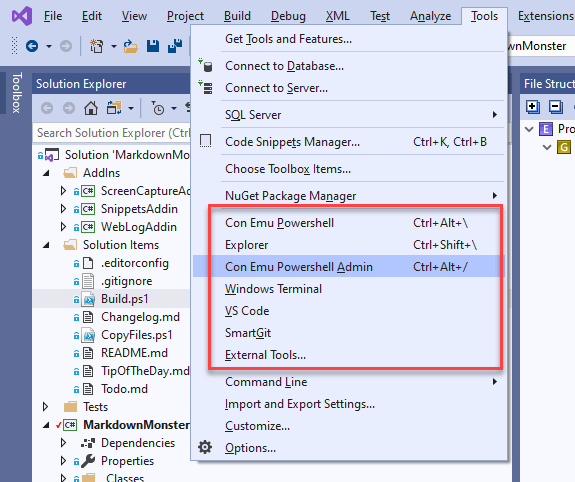
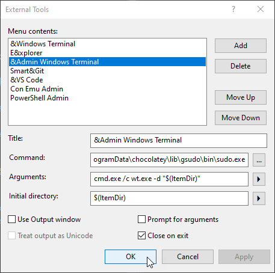

# Tip: Create a Visual Studio Menu option to Open a Terminal (and other things)

<small style="color: firebrick"><i>updated February 5th, 2021</i></small>

This isn’t exactly news, but I’ve been doing a lot more work with the command line these days from using build tools, file monitors, local Web servers, running Git, to doing Cordova builds and so on. My typical workflow for this has been to click on my [ConEmu](https://conemu.github.io/) shortcut on the Windows shortcut menu and then copy and paste the path to my project that’s buried 5 levels down from the root usually. This works, but gets tedious after a while.

BTW, if you need any convincing on using a console host other than the Command or Powershell terminals directly  check out [Scott Hanselman’s blog post](http://www.hanselman.com/blog/Console2ABetterWindowsCommandPrompt.aspx) from a few years back (he has several actually) – he talks about Console2 which was a popular shell replacement at the time, if for nothing else than the easier cut and paste features, but you also get multiple tabbed command shells and support for pre-configured shells of Command Prompts, PowerShell, Bash etc.. You can basically create custom shells for anything that has a CLI. These days other tools like [Windows Terminal](https://github.com/microsoft/terminal) and [ConEmu](https://conemu.github.io/) are more popular than Console2 at the time when this post was originally written.

Regardless of which terminal tool you use, it's very useful to add a few links to external shells, and other tools onto your Tools menu via the **External Tools** feature in Visual Studio.

Here’s a screen shot of my External Tools menu in Visual Studio 2019 and you can see Explorer, ConEmu and Windows Terminal both in user mode and admin represented there.

What's nice about External Tools over dedicated addins for these sort of things is - well, you don't need an addin. You can add whatever you want and set whatever options you want rather than letting an addin tell you how. You can also set shortcut keys both via the the menu options, or explicitly by assigning keyboard shortcuts to External Command options.

### Open Sesame: Open a Terminal From Visual Studio
As to terminal access, my most common scenario for opening a command prompt is that I’m in Visual Studio and decide I need to shell out quickly for doing a distribution build, or firing a Git command. 

The manual way to do this is:  

* Open an Explorer Window from current Folder (VS Menu option)
* Copy the current Path
* Open a Terminal Window
* `cd "<copiedPath>"`

This is pretty tedious. 

If you do this every time you open a Terminal take a few minutes to set up an External Command and save yourself a 30 seconds every time you do this.

##AD##

### Using External Tools in Visual Studio
One of the often overlooked features buried in the huge pile of features in Visual Studio is the *External Tools* section on the *Tools* menu.

The External Tools section is near the bottom of the big Tools menu and there are a number of items in there already. I don't use any of the built-in ones as they are legacy/C++ related thins, so one of the first things I do when I install Visual Studio is delete the original ones, but that's obviously not required if you need those.

To add a terminal as a tool click the **External Tools...** button then **Add** and then add any command using this dialog:

Click add to add a new Command, then type in name and point at your EXE file. You can use environment variables if necessary (`%localappdata%` for example) in the path. Otherwise provide a full path.

> Executables have to exist, so you can't use aliases. For example, you can't launch Windows Terminal with `wt` or `wt.exe` or VS Code with `code` without a path. Full path qualification is required.

For the Arguments you can then customize the command line that is fired to the tool. There are a number of expansions you can use with commands to specify the current item's full path `$(ItemPath)` or the current folder `$(ItemDir)` the active item lives in. You can also find the `$(ProjectDir)` and `$(SolutionDir)` for higher level folders. The dropdown buttons provide access to the long list of replacement macros available, but the above are the most likely candidates you'll use.

Once you click OK the new menu option is immediately available in the Tools menu.

### Visual Studio External Tool Setup For various Command Prompts
You can of course open other prompts. Maybe you like to open a plain Windows Command Prompt, Powershell, Bash or ConEmu.

Here are a few variations:

#### Windows Command Prompt
Creating a Command shell is very simple:

**Title**  
`Co&mmand`

**Command:**  
`cmd.exe`

**Initial Directory:**  
`$(ItemDir)`

#### Powershell
Creating a Powershell terminal is also very simple:

**Title:**  
`&Powershell`

**Command:**  
`C:\windows\system32\windowspowershell\v1.0\powershell.exe`

**Initial Directory:**  
`$(ItemDir)`

#### Explorer 

**Title**:   
`E&xplorer`

**Command:**  
`explorer.exe`

**Initial Directory:**  
`"$(ItemDir)"`

#### Windows Terminal 
Windows Terminal uses an alias and EXE in some nasty store buried folder. To keep this generic calling `cmd.exe` which handles the alias invocation can be used:

**Title**  
`&Windows Terminal`

**Command:**  
`cmd.exe`

**Initial Directory:**  
`/c wt.exe -d "$(ItemDir)"`

#### Windows Terminal Admin 
This one is even trickier - it requires an external launcher to elevate - I was unable to just make this works with `CMD` or `PowerShell`, so I'm using [GSudo from Chocolatey](https://chocolatey.org/packages/gsudo):

**Title**   
`&Admin Windows Terminal`

**Command:**  
`cmd.exe`

**Initial Directory:**  
`/c wt.exe -d "$(ItemDir)"`

#### ConEmu with Powershell
ConEmu is a popular shell host that lets you run multiple instances of command shells in a single window which makes it easier to manage multiple terminal Windows. I tend to use Powershell with ConEmu so I provide this info here as well.

**Title:**  
`ConEmu &Powershell`

**Command:**  
`C:\Program Files\ConEmu\ConEmu64.exe`

**Arguments:**  
`/dir $(ItemDir) /cmd {Powershell}`

Where `{Powershell}` is the name of one of the predefined consoles in the ConEmu Settings. If you'd rather run an **elevated prompt** you can use this instead:

**Title:**  
`ConEmu Powershell &Admin`

**Arguments:**  
`/dir $(ItemDir) /cmd {Powershell:Admin}`

Once you’re done, click OK and then you should find your option on the Tools menu ready for use.

##AD##

### Other non-Shell External Commands I use
Here are a couple of others I use all the time. As with the shell you :

#### Open in Visual Studio Code
Visual Studio code has a better editing experience for Web files so often when I'm dealing with large JavaScript, CSS or HTML files I want to open them in VS code rather than Visual Studio. To do this:

**Title:**  
`&VS Code`

**Command:**  
`C:\Program Files\Microsoft VS Code\Code.exe`

**Arguments**  
`$(ItemPath)`

> Note this opens the individual document. If you'd rather want to open the entire folder use `$(ItemDir)` instead.

#### Open in SmartGit (Git Gui)
Another really useful tool for me to access is my external GUI Git client. I use [SmartGit](https://www.syntevo.com/smartgit/) but this will work just as well with the Github Windows client, GitKraken or Fork.

**Title:**  
`Smart&Git`

**Command:**  
`C:\Program Files\SmartGit\bin\smartgit.exe`

**Arguments:**  
`$(ItemDir)`

### Using Menu Shortcut Keys
You may have noticed that I used the `&` in some of the **Title** of several of the tool commands, which provides a menu shortcut key for the command when they are added to the tools menu. This is quite useful as it allows you to access your tools via keyboard short cuts via Tool Menu access. 

For example **&Admin Windows Terminal** is available as `alt-t-a` and **E&xplorer** as `alt-t-x`. Et Voila: simple keyboard access to your tools. The nice thing is this is quick and easy to set up with just the prompts.

### Setting a Keyboard ShortCut
If you want something more permanent that also backs up with your Visual Studio Settings you can assign hotkeys to specific commands by command number. This depends on the order of the commands unfortunately but it's global and doesn't rely on the tools menu.

You can add a global shortcut using the **Tools | Options | Keyboard Settings**:

Search for **Tools.ExternalCommand** to find the list of external commands that are assignable. Commands are numbered 1 –24 in the order they are defined in the list. I moved my Command Prompt to position #1, but you can just count out (1 based) the position and use that ExternalCommand number instead. Set the menu option to an available key combination – I use Ctl-Shift-\ – and you’re off.

And voila – I can now press Ctrl-Shift-\ anytime to open a command prompt in my project folder.

### Summary
External Tools is an often overlooked feature of Visual Studio that allows you to quickly access common operations that are external to Visual Studio. It doesn't have to be a **Tool** per se - command line access, or Explorer are more generally useful things. But you can also force documents to be opened in external tools or use a different editor for certain files that Visual Studio otherwise manages. For example, I like to edit CSS/JavaScript files in VS Code rather than Visual Studio so I have an external tool shortcut (alt-t-v) to open the current document in VS Code for example. 

External tools is a generic tool, but it's very versatile and for me at least it serves a ton of time every day to open other tools. If you haven't looked at this, I'm sure you have at least one or two things that could benefit from being on **your** External Tools menu.

    
    this post created and published with the 
    <a href="https://markdownmonster.west-wind.com" 
       target="top">Markdown Monster Editor</a> 

