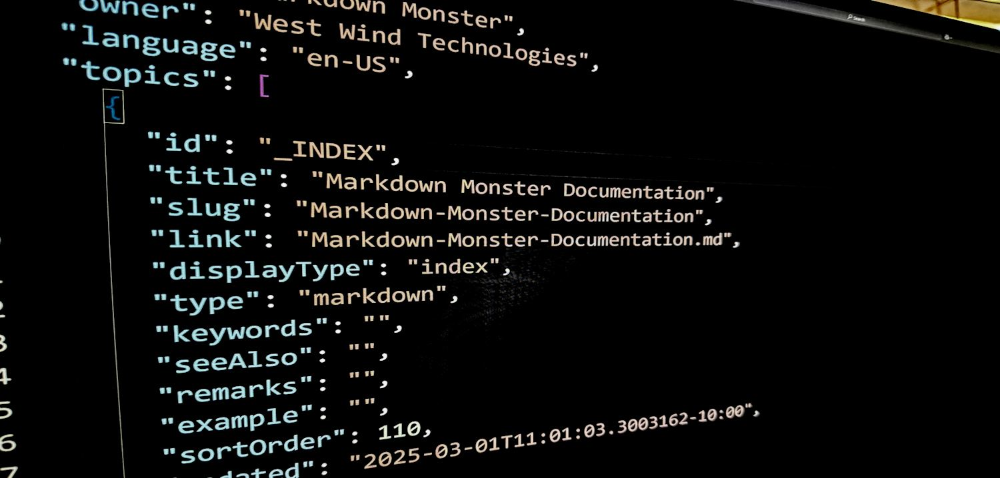

# Using JSON.NET for dynamic JSON parsing



With the release of ASP.NET Web API as part of .NET 4.5 and MVC 4.0, [JSON.NET](http://json.codeplex.com/) has effectively pushed out the .NET native serializers to become the default serializer for Web API. JSON.NET is vastly more flexible than the built in [DataContractJsonSerializer](http://msdn.microsoft.com/en-us/library/system.runtime.serialization.json.datacontractjsonserializer.aspx) or the older [JavaScript serializer](http://msdn.microsoft.com/en-us/library/system.web.script.serialization.javascriptserializer.aspx). The DataContractSerializer in particular has been very problematic in the past because it can't deal with untyped objects for serialization - like values of type _object,_ or anonymous types which are quite common these days. The JavaScript Serializer that came before it actually does support non-typed objects for serialization but it can't do anything with untyped data coming in from JavaScript and it's overall model of extensibility was pretty limited (JavaScript Serializer is what MVC uses for JSON responses).

JSON.NET provides a robust JSON serializer that has both high level and low level components, supports binary JSON, JSON contracts, Xml to JSON conversion, LINQ to JSON and many, many more features than either of the built in serializers. ASP.NET Web API now uses JSON.NET as its default serializer and is now pulled in as a NuGet dependency into Web API projects, which is great.

### Dynamic JSON Parsing

One of the features that I think is getting ever more important is the ability to serialize and deserialize arbitrary JSON content **dynamically** - that is without mapping the JSON captured directly into a .NET type as DataContractSerializer or the JavaScript Serializers do. Sometimes it isn't possible to map types due to the differences in languages (think collections, dictionaries etc), and other times you simply don't have the structures in place or don't want to create them to actually import the data.

If this topic sounds familiar - you're right! I wrote about dynamic JSON parsing a few months back before JSON.NET was added to Web API and when Web API and the System.Net HttpClient libraries included the System.Json classes like JsonObject and JsonArray. With the inclusion of JSON.NET in Web API these classes are now obsolete and didn't ship with Web API or the client libraries. I re-linked my original post to this one. In this post I'll discus JToken, JObject and JArray which are the dynamic JSON objects that make it very easy to create and retrieve JSON content on the fly without underlying types.

##AD##

### Why Dynamic JSON?

So, why Dynamic JSON parsing rather than strongly typed parsing? Since applications are interacting more and more with third party services it becomes ever more important to have easy access to those services with easy JSON parsing. Sometimes it just makes lot of sense to pull just a small amount of data out of large JSON document received from a service, because the third party service isn't directly related to your application's logic most of the time - and it makes little sense to map the entire service structure in your application.

For example, recently I worked with the [Google Maps Places API](https://developers.google.com/places/documentation/) to return information about businesses close to me (or rather the app's) location. The Google API returns a ton of information that my application had no interest in - all I needed was few values out of the data. Dynamic JSON parsing makes it possible to map this data, without having to map the entire API to a C# data structure. Instead I could pull out the three or four values I needed from the API and directly store it on my business entities that needed to receive the data - no need to map the entire Maps API structure.

### Getting JSON.NET

The easiest way to use JSON.NET is to grab it via NuGet and add it as a reference to your project. You can add it to your project with:

**PM> Install-Package Newtonsoft.Json**

From the Package Manager Console or by using Manage NuGet Packages in your project References. As mentioned if you're using ASP.NET Web API or MVC 4 JSON.NET will be automatically added to your project.

Alternately you can also go to the CodePlex site and download the latest version including source code:

[**http://json.codeplex.com/**](http://json.codeplex.com/)

### Creating JSON on the fly with JObject and JArray

Let's start with creating some JSON on the fly. It's super easy to create a dynamic object structure with any of the JToken derived JSON.NET objects. The most common JToken derived classes you are likely to use are JObject and JArray.

JToken implements IDynamicMetaProvider and so uses the _dynamic_  keyword extensively to make it intuitive to create object structures and turn them into JSON via dynamic object syntax. Here's an example of creating a music album structure with child songs using JObject for the base object and songs and JArray for the actual collection of songs:

```csharp
[TestMethod]
public void JObjectOutputTest()
{
    // strong typed instance 
    var jsonObject = new JObject();
                        
    // you can explicitly add values here using class interface
    jsonObject.Add("Entered", DateTime.Now);

    // or cast to dynamic to dynamically add/read properties    dynamic album = jsonObject;

    album.AlbumName = "Dirty Deeds Done Dirt Cheap";
    album.Artist = "AC/DC";
    album.YearReleased = 1976;

    album.Songs = new JArray() as dynamic;
            
    dynamic song = new JObject();
    song.SongName = "Dirty Deeds Done Dirt Cheap";
    song.SongLength = "4:11";
    album.Songs.Add(song);

    song = new JObject();
    song.SongName = "Love at First Feel";
    song.SongLength = "3:10";
    album.Songs.Add(song);

    Console.WriteLine(album.ToString());
}
```

This produces a complete JSON structure:

```csharp
{
  "Entered": "2012-08-18T13:26:37.7137482-10:00",
  "AlbumName": "Dirty Deeds Done Dirt Cheap",
  "Artist": "AC/DC",
  "YearReleased": 1976,
  "Songs": [
    {
      "SongName": "Dirty Deeds Done Dirt Cheap",
      "SongLength": "4:11"
    },
    {
      "SongName": "Love at First Feel",
      "SongLength": "3:10"
    }
  ]
}
```

Notice that JSON.NET does a nice job formatting the JSON, so it's easy to read and paste into blog posts :-). JSON.NET includes a bunch of configuration options that control how JSON is generated. Typically the defaults are just fine, but you can override with the JsonSettings object for most operations.

The important thing about this code is that there's no explicit type used for holding the values to serialize to JSON. Rather the JSON.NET objects are the containers that receive the data as I build up my JSON structure dynamically, simply by adding properties. This means this code can be entirely driven at runtime without compile time restraints of structure for the JSON output.

Here I use JObject to create a album 'object' and immediately cast it to dynamic. JObject() is kind of similar in behavior to [ExpandoObject](http://www.west-wind.com/weblog/posts/2012/Feb/08/Creating-a-dynamic-extensible-C-Expando-Object) in that it allows you to add properties by simply assigning to them. Internally, JObject values are stored in pseudo collections of key value pairs that are exposed as properties through the IDynamicMetaObject interface exposed in JSON.NET's JToken base class.

For objects the syntax is very clean - you add simple typed values as properties. For objects and arrays you have to explicitly create new JObject or JArray, cast them to dynamic and then add properties and items to them. Always remember though these values are dynamic - which means no Intellisense and no compiler type checking. It's up to you to ensure that the names and values you create are accessed consistently and without typos in your code.

Note that you can also access the JObject instance directly (not as dynamic) and get access to the underlying JObject type. This means you can assign properties by string, which can be useful for fully data driven JSON generation from other structures.

Below you can see both styles of access next to each other:

```csharp
// strong type instance 
var jsonObject = new JObject();

// you can explicitly add values here
jsonObject.Add("Entered", DateTime.Now);

// expando style instance you can just 'use' properties
dynamic album = jsonObject;

album.AlbumName = "Dirty Deeds Done Dirt Cheap";
```

JContainer (the base class for JObject and JArray) is a collection so you can also iterate over the properties at runtime easily:

```csharp
foreach (var item in jsonObject)
{
    Console.WriteLine(item.Key + " " + item.Value.ToString());
}
```

The functionality of the JSON objects are very similar to .[NET's ExpandObject](http://msdn.microsoft.com/en-us/library/system.dynamic.expandoobject.aspx) and if you used it before, you're already familiar with how the dynamic interfaces to the JSON objects works.

##AD##

### Importing JSON with JObject.Parse() and JArray.Parse()

The JValue structure supports importing JSON via the Parse() and Load() methods which can read JSON data from a string or various streams respectively. Essentially JValue includes the core JSON parsing to turn a JSON string into a collection of JsonValue objects that can be then referenced using familiar dynamic object syntax.

Here's a simple example:

```csharp
public void JValueParsingTest()
{
    var jsonString = @"{""Name"":""Rick"",""Company"":""West Wind"",
                        ""Entered"":""2012-03-16T00:03:33.245-10:00""}";

    dynamic json = JValue.Parse(jsonString);

    // values require casting
    string name = json.Name;
    string company = json.Company;
    DateTime entered = json.Entered;

    Assert.AreEqual(name, "Rick");
    Assert.AreEqual(company, "West Wind");            
}
```

The JSON string represents an object with three properties which is parsed into a JObject class and cast to dynamic. Once cast to dynamic I can then go ahead and access the object using familiar object syntax.

Note that the actual values - json.Name, json.Company, json.Entered - are actually of type JToken and I have to cast them to their appropriate types first before I can do type comparisons as in the Asserts at the end of the test method. This is required because of the way that dynamic types work which can't determine the type based on the method signature of the Assert.AreEqual(object,object) method. I have to either assign the dynamic value to a variable as I did above, or explicitly cast ( (string) json.Name) in the actual method call.

The JSON structure can be much more complex than this simple example. Here's another example of an array of albums serialized to JSON and then parsed through with JsonValue():

```csharp
[TestMethod]
public void JsonArrayParsingTest()
{
    var jsonString = @"[
{
""Id"": ""b3ec4e5c"",
""AlbumName"": ""Dirty Deeds Done Dirt Cheap"",
""Artist"": ""AC/DC"",
""YearReleased"": 1976,
""Entered"": ""2012-03-16T00:13:12.2810521-10:00"",
""AlbumImageUrl"": ""http://ecx.images-amazon.com/images/I/61kTaH-uZBL._AA115_.jpg"",
""AmazonUrl"": ""http://www.amazon.com/gp/product/…ASIN=B00008BXJ4"",
""Songs"": [
    {
    ""AlbumId"": ""b3ec4e5c"",
    ""SongName"": ""Dirty Deeds Done Dirt Cheap"",
    ""SongLength"": ""4:11""
    },
    {
    ""AlbumId"": ""b3ec4e5c"",
    ""SongName"": ""Love at First Feel"",
    ""SongLength"": ""3:10""
    },
    {
    ""AlbumId"": ""b3ec4e5c"",
    ""SongName"": ""Big Balls"",
    ""SongLength"": ""2:38""
    }
]
},
{
""Id"": ""7b919432"",
""AlbumName"": ""End of the Silence"",
""Artist"": ""Henry Rollins Band"",
""YearReleased"": 1992,
""Entered"": ""2012-03-16T00:13:12.2800521-10:00"",
""AlbumImageUrl"": ""http://ecx.images-amazon.com/images/I/51FO3rb1tuL._SL160_AA160_.jpg"",
""AmazonUrl"": ""http://www.amazon.com/End-Silence-Rollins-Band/dp/B0000040OX/ref=sr_1_5?ie=UTF8&qid=1302232195&sr=8-5"",
""Songs"": [
    {
    ""AlbumId"": ""7b919432"",
    ""SongName"": ""Low Self Opinion"",
    ""SongLength"": ""5:24""
    },
    {
    ""AlbumId"": ""7b919432"",
    ""SongName"": ""Grip"",
    ""SongLength"": ""4:51""
    }
]
}
]";

    JArray jsonVal = JArray.Parse(jsonString) as JArray;
    dynamic albums = jsonVal;

    foreach (dynamic album in albums)
    {
        Console.WriteLine(album.AlbumName + " (" + album.YearReleased.ToString() + ")");
        foreach (dynamic song in album.Songs)
        {
            Console.WriteLine("\t" + song.SongName);
        }
    }

    Console.WriteLine(albums[0].AlbumName);
    Console.WriteLine(albums[0].Songs[1].SongName);
}
```

### JObject and JArray in ASP.NET Web API

Of course these types also work in ASP.NET Web API controller methods. If you want you can accept parameters using these object or return them back to the server.

The following contrived example receives dynamic JSON input, and then creates a new dynamic JSON object and returns it based on data from the first:

```csharp
[HttpPost]
public JObject PostAlbumJObject(JObject jAlbum)
{
    // dynamic input from inbound JSON
    dynamic album = jAlbum;

    // create a new JSON object to write out
    dynamic newAlbum = new JObject();

    // Create properties on the new instance
    // with values from the first
    newAlbum.AlbumName = album.AlbumName + " New";
    newAlbum.NewProperty = "something new";
    newAlbum.Songs = new JArray();
    
    foreach (dynamic song in album.Songs)
    {
        song.SongName = song.SongName + " New"; 
        newAlbum.Songs.Add(song);                
    }
            
    return newAlbum;
}
```

The raw POST request to the server looks something like this:

```http
POST http://localhost/aspnetwebapi/samples/PostAlbumJObject HTTP/1.1
User-Agent: Fiddler
Content-type: application/json
Host: localhost
Content-Length: 88

{AlbumName: "Dirty Deeds",Songs:[ { SongName: "Problem Child"},{ SongName: "Squealer"}]}
```

and the output that comes back looks like this:

```json
{
  "AlbumName": "Dirty Deeds New",
  "NewProperty": "something new",
  "Songs": [
    {
      "SongName": "Problem Child New"
    },
    {
      "SongName": "Squealer New"
    }
  ]
}
```

The original values are echoed back with something extra appended to demonstrate that we're working with a new object.

When you receive or return a JObject, JValue, JToken or JArray instance in a Web API method, Web API ignores normal content negotiation and assumes your content is going to be received and returned as JSON, so effectively the parameter and result type explicitly determines the input and output format which is nice.

##AD##

### Dynamic to Strong Type Mapping

You can also map JObject and JArray instances to a strongly typed object, so you can mix dynamic and static typing in the same piece of code. Using the 2 Album jsonString shown earlier, the code below takes an array of albums and picks out only a single album and casts that album to a static Album instance.

```csharp
[TestMethod]
public void JsonParseToStrongTypeTest()
{
    JArray albums = JArray.Parse(jsonString) as JArray;

    // pick out one album
    JObject jalbum = albums[0] as JObject;

    // Copy to a static Album instance
    Album album = jalbum.ToObject<Album>();

    Assert.IsNotNull(album);
    Assert.AreEqual(album.AlbumName,jalbum.Value<string>("AlbumName"));
    Assert.IsTrue(album.Songs.Count > 0);
}
```

This is pretty damn useful for the scenario I mentioned earlier - you can read a large chunk of JSON and dynamically walk the property hierarchy down to the item you want to access, and then either access the specific item dynamically (as shown earlier) or map a part of the JSON to a strongly typed object. That's very powerful if you think about it - it leaves you in total control to decide what's dynamic and what's static.

### Strongly typed JSON Parsing

With all this talk of dynamic let's not forget that JSON.NET of course also does strongly typed serialization which is drop dead easy. Here's a simple example on how to serialize and deserialize an object with JSON.NET:

```csharp
[TestMethod]
public void StronglyTypedSerializationTest()
{

    // Demonstrate deserialization from a raw string
    var album = new Album()
    {
        AlbumName = "Dirty Deeds Done Dirt Cheap",
        Artist = "AC/DC",
        Entered = DateTime.Now,
        YearReleased = 1976,
        Songs =  new List<Song>() 
        {
            new Song()
            {
                SongName = "Dirty Deeds Done Dirt Cheap",
                SongLength = "4:11"
            },
            new Song()
            {
                SongName = "Love at First Feel",
                SongLength = "3:10"
            }
        }
    };
            
    // serialize to string            
    string json2 = JsonConvert.SerializeObject(album,Formatting.Indented);

    Console.WriteLine(json2);

    // make sure we can serialize back
    var album2 = JsonConvert.DeserializeObject<Album>(json2);

    Assert.IsNotNull(album2);
    Assert.IsTrue(album2.AlbumName == "Dirty Deeds Done Dirt Cheap");
    Assert.IsTrue(album2.Songs.Count == 2);
}
```

JsonConvert is a high level static class that wraps lower level functionality, but you can also use the JsonSerializer class, which allows you to serialize/parse to and from streams. It's a little more work, but gives you a bit more control. The functionality available is easy to discover with Intellisense, and that's good because there's not a lot in the way of documentation that's actually useful.

### Summary

JSON.NET is a pretty complete JSON implementation with lots of different choices for JSON parsing from dynamic parsing to static serialization, to complex querying of JSON objects using LINQ. It's good to see this open source library getting integrated into .NET, and pushing out the old and tired stock .NET parsers so that we finally have a bit more flexibility - and extensibility - in our JSON parsing. Good to go!

### Resources

* [Sample Test Project](http://west-wind.com/files/Demos/2012/JsonValue.zip)
* [JSON.NET](https://github.com/JamesNK/Newtonsoft.Json)


<div style="margin-top: 30px;font-size: 0.8em;
            border-top: 1px solid #eee;padding-top: 8px;">
    
    this post created and published with 
    <a href="https://markdownmonster.west-wind.com" 
       target="top">Markdown Monster</a> 
</div>


